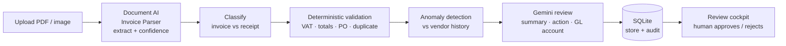

# Patcy — Invoice Intelligence

> Invoice intelligence that catches what shouldn't be there.

Patcy reads supplier **invoices and receipts**, extracts the data, checks it against company
policy, has an LLM review it, **flags anomalies against vendor history**, and hands a human the
final decision. It's a hybrid pipeline: a **specialized AI extracts**, **deterministic code
validates**, an **LLM reasons**, and a **person decides** — the model never overrides the rules.

Built on **Google Cloud** (Document AI + Gemini), **FastAPI**, and **React**.

---

## Architecture



The rules and anomaly flags are **authoritative** — if either fires, the LLM is instructed never
to recommend "approve." Humans make the final call.

## Features

- **Extraction with confidence** — Google Document AI Invoice Parser returns structured fields
  (vendor, VAT, totals, dates, PO) with a per-field confidence score.
- **Invoice vs receipt classification** — receipts skip invoice-only rules (no PO / vendor VAT required).
- **Deterministic policy validation** — EU VAT checksum (`python-stdnum`), `subtotal + tax = total`
  (exact `Decimal` math), purchase-order presence, customer-VAT match, and **duplicate detection**.
- **Fraud / anomaly detection** — flags invoices that don't fit a vendor's history
  (e.g. *"4.8× higher than this vendor's average"*), using the stored invoice history.
- **LLM review + GL coding** — Gemini writes a plain-language review, recommends approve / needs-review /
  reject, and assigns a general-ledger account, via the OpenAI-compatible endpoint.
- **Review cockpit** — the document rendered beside the extracted data, low-confidence fields flagged
  for the reviewer, and approve / reject / request-changes controls.
- **Persistence & audit** — every processed document and decision stored in SQLite.

## Tech stack

| Layer | Tech |
|-------|------|
| Extraction | Google **Document AI** (Invoice Parser) |
| Reasoning | Google **Gemini** (via the OpenAI-compatible API) |
| Backend | Python 3.12, **FastAPI**, SQLAlchemy + SQLite, Pydantic, python-stdnum, uv |
| Frontend | **React 19**, Vite, TypeScript, Tailwind CSS v4 |

## Ported from Azure to GCP

This started as an Azure build (Azure Document Intelligence + Azure OpenAI) and was
**re-architected for Google Cloud**: Document Intelligence → **Document AI**, Azure OpenAI →
**Gemini** (through the OpenAI-compatible endpoint, so the client code barely changed). Added on top:
per-field confidence surfacing, vendor-history anomaly detection, and a redesigned review cockpit.

## Getting started

**Prerequisites:** Python 3.12, [uv](https://docs.astral.sh/uv/), Node + pnpm, a GCP project with
the Document AI API enabled and an **Invoice Parser** processor, a **Gemini API key**, and
`gcloud auth application-default login`.

### Backend
```bash
cd backend
cp .env.example .env      # set GEMINI_API_KEY, GCP_PROJECT_ID, DOCAI_LOCATION, DOCAI_PROCESSOR_ID
uv venv --python 3.12 && source .venv/bin/activate
uv sync
gcloud auth application-default login
uv run uvicorn app.main:app --reload --port 8000
```

### Frontend
```bash
cd frontend
cp .env.example .env      # VITE_API_BASE_URL=http://localhost:8000
pnpm install
pnpm dev                  # http://localhost:5173
```

## Validation issue codes

| Code | Meaning |
|------|---------|
| `vendor_vat_id_required` | Vendor VAT missing |
| `vendor_vat_id_invalid`  | Vendor VAT fails checksum |
| `customer_vat_id_mismatch` | Buyer VAT ≠ company VAT |
| `purchase_order_missing` | No PO on an invoice |
| `invoice_total_mismatch` | subtotal + tax ≠ total |
| `duplicate_invoice` | Invoice number already seen |

## Notes

Secrets live in per-service `.env` files (git-ignored); `.env.example` files list the variables.
Never commit real keys — if one is exposed, rotate it immediately.

## Acknowledgements

Built following Datalumina's end-to-end invoice-review project, then re-implemented on Google Cloud
with added confidence scoring, fraud/anomaly detection, and a redesigned review cockpit.
